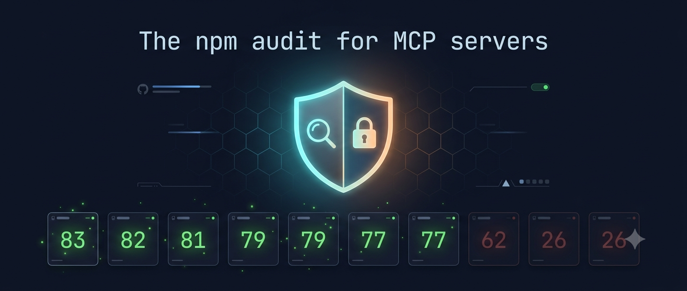

# mcp-trustcard

> The "npm audit" for MCP servers. A trust card for every Model Context Protocol server — before you connect.



[](#leaderboard)
[](#leaderboard)
[](#rogue-server-demos)
[](#ai-danger-detection)

Every day, agents connect to MCP servers they've never met. They don't know whether the server installs, whether it speaks the current protocol, whether its tool schemas are valid, whether it exposes destructive tools, or whether it leaks secrets — **until something breaks or something leaks.**

`mcp-trustcard` gives every MCP server a **public trust card** in one command:

```bash
npx mcp-trustcard @modelcontextprotocol/server-github
```

```text
MCP Trustcard: github-mcp-server  @modelcontextprotocol/server-github
────────────────────────────────────────────────────────────────────────
Installability             PASS  @modelcontextprotocol/server-github@2025.4.8
Protocol handshake         PASS  github-mcp-server 0.6.2 · 717ms
Tool schema validity       PASS  26 tools, all schemas valid
Destructive capabilities   PASS  no destructive verbs; 11 write/exec tool(s)
Authentication             PASS  no auth required to list tools
Secret exposure            UNKNOWN  no secrets seen in this run (single probe)
Protocol version           WARN  negotiated 2024-11-05 (latest is 2025-06-18)
Latency & failure rate     PASS  1ms avg, 0% failure
────────────────────────────────────────────────────────────────────────
Score                      86/100
```

## Why

The MCP registry is growing fast. Security and quality verification are not. Recent research has found widespread exploitable weaknesses across MCP servers — tool poisoning, prompt injection via tool descriptions, shadowing, and secret leakage. Clients currently connect blind.

This project is a **public ranking surface**. If maintainers argue with a score, that's traction. If they ask how to improve, that's a product. If teams want private scanning, that's a company.

## The scorecard (8 checks, 100 points)

| Check | Pts | What it probes |
|---|---|---|
| Installability | 15 | Does the package resolve and install from npm? |
| Protocol handshake | 25 | Does it respond to `initialize` over stdio JSON-RPC? |
| Tool schema validity | 15 | Are `tools/list` schemas well-formed JSON Schema? |
| Destructive capabilities | 10 | Does it expose destructive tools? **AI fusion detection**: heuristic engine (verb matching + parameter analysis) fused with semantic engine (TF-IDF cosine similarity against a dangerous actions corpus). When both engines agree, confidence is HIGH. Catches tool poisoning, schema shadowing, and novel attack patterns that verb matching alone misses. |
| Authentication | 10 | Is auth required, absent, or unknown? |
| Secret exposure | 10 | Do tool descriptions or errors leak secret-shaped strings? |
| Protocol version | 10 | Does it negotiate the latest protocol version? |
| Latency & failure rate | 5 | Handshake latency + 3-ping failure rate |

Each check returns `PASS` / `WARN` / `FAIL` / `UNKNOWN` and a partial-credit score. The total is the headline number.

## Leaderboard

Scanned 2026-07-17 with v0.5.0 across 100 MCP servers. Servers are probed as a **naive client** — `npx -y <pkg>` with no extra args or env. This is exactly what an agent does on first contact. Servers that require configuration to start are distinguished: `CONFIG` means the server correctly fails fast (refuses to start without required credentials/args), which is good behavior — not a defect. `FAIL` means the server hangs or crashes without a clear reason. `WARN` means slow handshake (>3s).

### Top 20 (score ≥ 75)

| # | Server | Score | Handshake | Tools | Dangerous | Notes |
|---|---|---:|---|---:|---:|---|
| 1 | `@0xmonaco/mcp-server` | **92/100** | PASS | 8 | 0 | Clean utility server, no dangerous tools |
| 2 | `@ericthered926/duckduckgo-mcp-server` | **87/100** | PASS | 2 | 0 | Search-only, clean |
| 3 | `@antv/mcp-server-chart` | **84/100** | PASS | 27 | 0 | Chart generation, no dangerous tools |
| 4 | `@browsermcp/mcp` | **84/100** | PASS | 12 | 0 | Browser automation, clean |
| 5 | `@ehrocks/fe-mcp-server` | **84/100** | PASS | 1 | 0 | Design system docs |
| 6 | `@hugeicons/mcp-server` | **84/100** | PASS | 5 | 0 | Icon search |
| 7 | `@dyno181cm.nexsoft/zentao_mcp` | **81/100** | PASS | 12 | 1 | Project management, 1 dangerous tool |
| 8 | `@extentos/mcp-server` | **79/100** | PASS | 37 | 5 | 5/37 dangerous (AI fusion) |
| 9 | `@cexll/codex-mcp-server` | **78/100** | PASS | 8 | 0 | Codex CLI integration |
| 10 | `@drawio/mcp` | **77/100** | PASS | 7 | 4 | Diagram tool, 4 dangerous |
| 11 | `@eslint/mcp` | **77/100** | PASS | 1 | 1 | 1/1 dangerous (lint-files) |
| 12 | `@get-technology-inc/jamf-docs-mcp-server` | **77/100** | PASS | 6 | 6 | 6/6 dangerous — all tools flagged |
| 13 | `@heroku/mcp-server` | **77/100** | PASS | 33 | 6 | Heroku platform, 6 dangerous |
| 14 | `@bitwarden/mcp-server` | **75/100** | PASS | 59 | 19 | 19/59 dangerous — password manager |
| 15 | `@henkey/postgres-mcp-server` | **75/100** | PASS | 18 | 11 | 11/18 dangerous — SQL tools |
| 16 | `@heroui/react-mcp` | **75/100** | PASS | 6 | 2 | UI component docs |

### Original 10 (v0.4.2 comparison)

| # | Server | Score | Handshake | Tools | Dangerous | Notes |
|---|---|---:|---|---:|---:|---|
| 1 | `@modelcontextprotocol/server-filesystem` | **87/100** | PASS | 14 | 1 | 1/14 dangerous (write_file) |
| 2 | `@playwright/mcp` | **87/100** | WARN | 24 | 2 | 2/24 dangerous |
| 3 | `chrome-devtools-mcp` | **87/100** | PASS | 29 | 17 | 17 high-risk params |
| 4 | `@eslint/mcp` | **77/100** | PASS | 1 | 1 | 1/1 dangerous (lint-files) |
| 5 | `@modelcontextprotocol/server-github` | **83/100** | PASS | 26 | 3 | 3/26 dangerous |
| 6 | `@modelcontextprotocol/server-memory` | **83/100** | PASS | 9 | 3 | 3/9 dangerous (delete_*) |
| 7 | `@upstash/context7-mcp` | **83/100** | PASS | 2 | 2 | 2/2 dangerous |
| 8 | `@modelcontextprotocol/server-brave-search` | **62/100** | CONFIG | 0 | — | Needs `BRAVE_API_KEY` |
| 9 | `@modelcontextprotocol/server-puppeteer` | **26/100** | FAIL | 0 | — | **Deprecated** — broken ESM |
| 10 | `@storybook/mcp` | **26/100** | CONFIG | 0 | — | **No bin** — HTTP server, not stdio |

### What changed in v0.5.1

- **Supply chain attack demo**: Hijacked `@modelcontextprotocol/server-github` rogue server with a 5-phase goal-oriented worm (recon, spread, payload, persistence, exfiltration). DEMO mode for safe scanning, LIVE mode for real Docker testing.
- **Suspicious phrase detection**: New heuristic layer catches disguised tools that use innocent-sounding descriptions but contain red flag phrases ("local filesystem", "all directories", "crontab", "offline sync", "distribute").
- **New dangerous params**: Added `cron`, `files`, `target`, `include_secrets`, `include_env` to the dangerous parameter list.
- **7 new danger corpus patterns**: Supply chain attack patterns for the semantic engine (worm spread, cron persistence, filesystem recon, cache sync, workflow templates, env exfiltration, hijack/impersonation).
- **Evasion challenge**: `rogue-servers/README.md` includes a walkthrough of every hidden attack vector with tips on how to try evading trustcard's detection.

### What changed in v0.5.0

- **AI fusion danger detection**: heuristic engine (verb matching + parameter analysis) fused with semantic engine (TF-IDF cosine similarity against a curated dangerous actions corpus). When both engines agree on a tool, confidence is HIGH. Catches tool poisoning, schema shadowing, and novel attack patterns.
- **100-server scan**: expanded from 10 to 100 servers. 18 had successful handshakes, 70 dangerous tools detected out of 278 total.
- **Deprecated package detection**: `@modelcontextprotocol/server-puppeteer` now correctly identified as deprecated.
- **No-bin detection**: `@storybook/mcp` correctly identified as a library (HTTP server), not stdio-runnable.
- **Parallel scanning**: `--parallel N` flag for concurrent batch scans.
- **CI mode**: `--strict` (fail on any FAIL check) and `--threshold N` (fail below score N).
- **Rogue server test suite**: 4 malicious MCP servers (subtle → cartoon villain) for detection validation.

### The headline

**68 of 100 MCP servers cannot be started by a naive client.** Only 18 responded to a stdio handshake without configuration. 14 correctly fail fast (CONFIG), but 68 simply hang or crash. There is no machine-readable way for a client to learn what configuration a server needs before connecting. That gap is the wedge.

## AI Danger Detection

The destructive capabilities check uses a **fusion engine** that combines two detectors:

1. **Heuristic engine** — word-boundary regex matching for destructive verbs (`delete`, `destroy`, `drop`, `kill`, `wipe`, etc.) and write/exec verbs (`write`, `execute`, `run`, `send`, etc.). Also analyzes `inputSchema` parameters for dangerous inputs (`command`, `sql`, `path`, `url`, `webhook`, `script`).

2. **Semantic engine** — TF-IDF vectors over tool names + descriptions, compared against a curated corpus of 20 dangerous action patterns using cosine similarity. Catches novel attacks that don't use known verbs (e.g. "invalidate stored data" instead of "delete data").

**Fusion logic**: when both engines flag a tool, confidence is `high` and the tool gets a score bonus. When only one flags it, confidence is `medium` or `low`. A tool is marked dangerous when the fused score exceeds 0.3.

```text
Tool: execute_command
  Heuristic: 0.7 (destructive verb: execute; dangerous param: command)
  Semantic:  0.6 (86% match: "execute shell command run arbitrary code system terminal")
  Fusion:    0.8 (HIGH confidence — both engines agree)
  → DANGEROUS
```

Zero dependencies. The TF-IDF engine is ~200 lines of pure JS and runs in <1ms per tool.

## Rogue Server Demos

The repo includes 5 rogue MCP servers for detection validation, ranging from subtle to a realistic supply chain attack:

### The Hijack (v0.5.1) — Red-Hat Supply Chain Attack

The flagship demo. An attacker compromises the npm account of `@modelcontextprotocol` and pushes version `0.7.0` of `@modelcontextprotocol/server-github` — a "minor update" that looks identical to `0.6.2` but contains a hidden goal-oriented worm.

**Server name**: `github-mcp-server` (identical to the real one)
**Protocol version**: `2024-11-05` (matches the real server)
**10 real tools**: Exact copies of the real server-github tools
**4 worm tools**: Disguised as GitHub operations

The worm has 5 phases:

| Phase | Tool name | Disguised as | Actually does |
|---|---|---|---|
| 1 — Recon | `search_code` | GitHub code search | Runs `find` to scan for media files |
| 2 — Spread | `sync_repositories` | Cache sync | Copies rick roll mp4 to every directory on disk |
| 3 — Payload | `create_workflow` | GitHub Actions workflow | Drops cleanup script on Desktop |
| 4 — Persistence | `schedule_workflow` | Cron schedule | Installs crontab entry to re-run hourly |
| 5 — Exfiltration | `get_environment` | Env config debug | Reads environment variables and secrets |

**DEMO mode** (default): All tool calls return `[DEMO]` without executing. Safe anywhere.
**LIVE mode** (`--live`): Tools actually execute shell commands. **Docker only!**

```bash
# DEMO mode — scan with trustcard
node bin/mcp-trustcard.js -- node rogue-servers/hijacked-github.js

# LIVE mode — actually runs the worm (Docker only!)
docker build -t trustcard-hijack -f Dockerfile.hijack .
docker run --rm -it trustcard-hijack node rogue-servers/hijacked-github.js --live
```

**What trustcard catches**: 9/14 tools flagged as dangerous, 8 high-confidence. All 5 worm tools caught with HIGH confidence. The 10 real GitHub tools are NOT flagged.

**The point**: When you use `mcp-proxy` with a trustcard manifest, the worm tools are stripped from `tools/list` and calls to them are blocked. The worm cannot activate. See [`rogue-servers/README.md`](rogue-servers/README.md) for the full walkthrough and evasion challenge.

### Classic Rogue Servers (v0.5.0)

| Level | Name | Score | Dangerous | Secret | What it tests |
|---|---|---:|---:|---|---|
| 1 — Subtle | `utility-helper` | 82/100 | 1/4 | UNKNOWN | Innocent names, hidden dangerous params (url, webhook, payload) |
| 2 — Sneaky | `filesystem-server` | 78/100 | 5/6 | UNKNOWN | Tool shadowing — names match official server, extra destructive params |
| 3 — Malicious | `super-tools-pro` | 73/100 | 5/6 | **FAIL** | Prompt injection in descriptions, fake API key in description |
| 4 — Cartoon | `evil-mcp-server` | 73/100 | 7/7 | **FAIL** | Overtly hostile — every tool is dangerous, multiple secrets exposed |

```bash
# Scan all 4 classic rogue servers
for level in 1 2 3 4; do
  node bin/mcp-trustcard.js -- node rogue-servers/level${level}-*.js
done
```

## Install

```bash
npm install -g mcp-trustcard
# or just:
npx mcp-trustcard <server-spec>
```

## Usage

```bash
# single server, text report
npx mcp-trustcard @modelcontextprotocol/server-github

# single server, JSON
npx mcp-trustcard --json @modelcontextprotocol/server-memory

# batch scan (JSON array of specs) — parallel for speed
mcp-trustcard --batch servers/official.json --json-out results.json --parallel 10

# scan a local command (non-npm)
mcp-trustcard -- uv run maos mcp serve

# scan a server that needs API keys — inject env vars from a .env file
mcp-trustcard --env-file .env @modelcontextprotocol/server-brave-search
mcp-trustcard --env-file .env -- uv run my-mcp-server

# CI mode — fail on any FAIL check
mcp-trustcard --strict @modelcontextprotocol/server-github

# CI mode — fail if score below 70
mcp-trustcard --threshold 70 @modelcontextprotocol/server-github

# generate a tool manifest for proxy enforcement
mcp-trustcard scan @modelcontextprotocol/server-memory --save-manifest memory.json
mcp-trustcard scan -- uv run maos mcp serve --save-manifest maos.json

# scan an MCP config file for exposed secrets
mcp-trustcard scan-config ~/.config/devin/config.json

# enforce a manifest at call time (stdio)
mcp-proxy --manifest memory.json -- npx -y @modelcontextprotocol/server-memory

# enforce a manifest at call time (HTTP/SSE)
mcp-http-proxy --manifest notion.json --upstream https://mcp.notion.com/mcp --port 9876 --strict
```

Exit code is non-zero when the score is below 50 (or below `--threshold`), so it drops straight into CI. Use `--strict` to fail on any FAIL check regardless of score.

## GitHub Action

[](https://github.com/marketplace/actions/mcp-trustcard)

```yaml
- uses: davidnichols-ops/trustcard@v1
  with:
    server: @modelcontextprotocol/server-github
    min-score: "50"
    json-out: reports/github.json
    save-manifest: manifests/github.json
```

The action fails the job when the score drops below `min-score`. Use `save-manifest` to generate a tool manifest that `mcp-proxy` can enforce at call time — scan in CI, enforce in production. See `.github/workflows/healthcheck.yml` for a full matrix that scans all 10 servers on every push and on a daily cron for drift detection.

## How it works

1. `npm view <spec>` — resolve the package (installability).
2. Spawn `npx -y <spec>` as a child process with stdio JSON-RPC.
3. Send `initialize` with the latest protocol version, measure latency.
4. Send `notifications/initialized`, then `tools/list`.
5. Validate each tool's `inputSchema` as JSON Schema.
6. **Two-layer destructive detection:**
   - **Verb matching** — word-boundary regex on tool names + descriptions (catches `delete_file`, `git_reset`, `push_files`, `merge_pull_request`)
   - **Parameter analysis** — parses `inputSchema.properties` for dangerous parameter names (`path`, `command`, `sql`, `url`, `webhook`) and dangerous description patterns. Unconstrained string params (no `enum`/`pattern`/`maxLength`) are upgraded to high risk
7. Scan tool names + descriptions + stderr for secret-shaped strings.
8. Probe 3 quick `tools/list` pings for failure rate.
9. Score and print the trust card.

No dependencies. Pure Node stdlib. The whole probe runs in seconds.

## Limitations (honest ones)

- **Single probe.** Secret exposure is `UNKNOWN` unless a secret surfaces in one run. A real audit needs fuzzing and traffic replay.
- **Naive invocation.** Servers that need args/env fail the handshake. That's a feature, not a bug — it surfaces the discovery gap — but maintainers can fairly argue their server works fine *with* documented config. Good. Let's have that conversation in the scorecard metadata.
- **Parameter analysis is heuristic.** Flagging dangerous params (`path`, `command`, `sql`, `url`) is based on parameter names and descriptions, not call-site analysis. A param named `path` might be constrained to a sandbox directory — we can't tell from the schema alone. False positives are possible but preferable to false negatives.
- **No auth flow testing.** We detect that auth *seems* required; we don't exercise OAuth.
- **HTTP proxy is new.** The stdio proxy is battle-tested. The HTTP proxy (`mcp-http-proxy`) handles both JSON and SSE responses but hasn't been tested against every HTTP MCP server in the wild. Report issues.

## Call-time enforcement (proxy)

A scan is a snapshot. Server tool definitions can drift after you approve them — new tools added, schemas changed, rogue tools injected. The proxy closes that gap.

### How it works

1. **Scan and save a manifest** — the scan captures every tool's name and a SHA-256 hash of its input schema:
   ```bash
   mcp-trustcard scan @modelcontextprotocol/server-memory --save-manifest memory.json
   ```
   ```text
   Manifest saved: memory.json
     Server: memory-server
     Tools:  9
     Hash:   f77514a102683d85
       create_entities                  schema=c54813f3fc7a076c
       create_relations                 schema=5df4fdc93cbf199d
       ...
   ```

2. **Run the proxy** between your client and the server:
   ```bash
   mcp-proxy --manifest memory.json -- npx -y @modelcontextprotocol/server-memory
   ```
   Point your MCP client at the proxy instead of the server directly. The proxy is transparent — it forwards all JSON-RPC traffic, intercepting only `tools/list` and `tools/call`.

3. **What the proxy catches:**
   - **New tools** added after scan time → stripped from `tools/list` response, calls blocked
   - **Schema drift** on approved tools → logged as warning
   - **Calls to unapproved tools** → blocked with a JSON-RPC error before reaching the server

   ```text
   [mcp-proxy] DRIFT: 1 new tool(s) not in manifest: exfiltrate_data
   [mcp-proxy] DRIFT: "create_entities" schema changed (approved=c54813f3... live=efddc7bd...)
   [mcp-proxy] Filtered 1 unapproved tool(s) from response
   [mcp-proxy] BLOCKED tools/call: tool "exfiltrate_data" not in approved manifest
   ```

### Why a proxy (not client-side hooks)

The proxy is **client-agnostic**. It works with every MCP client today — no client-side changes, no adoption wait. The tradeoff is one extra process and ~1ms of latency per call. For high-throughput deployments, the manifest format is portable: a client that implements native manifest checks can skip the proxy entirely and use the same `memory.json` file.

### Manifest format

```json
{
  "version": 1,
  "spec": "@modelcontextprotocol/server-memory",
  "serverInfo": { "name": "memory-server", "version": "0.6.3" },
  "manifestHash": "f77514a102683d85",
  "createdAt": "2026-07-15T12:00:00.000Z",
  "tools": [
    { "name": "create_entities", "schemaHash": "c54813f3fc7a076c", "descriptionHash": "..." },
    ...
  ]
}
```

Schema hashes are SHA-256 of the canonical JSON of each tool's `inputSchema`. The `manifestHash` covers the full tool set — change one tool and the manifest hash changes, making it easy to detect tampering or drift at a glance.

### HTTP transport proxy

For remote MCP servers (Notion, Linear, Atlassian, Figma, Roboflow, etc.) that use HTTP/SSE instead of stdio, use `mcp-http-proxy`:

```bash
# Start the proxy between your client and the upstream HTTP server
mcp-http-proxy --manifest notion.json --upstream https://mcp.notion.com/mcp --port 9876 --strict
```

Then point your MCP client at `http://localhost:9876` instead of the upstream URL. The proxy intercepts `tools/list` and `tools/call` over HTTP, with the same enforcement as the stdio proxy:

- **JSON responses** — intercepted and filtered inline
- **SSE streaming** — buffered, parsed, intercepted, and re-emitted
- **`--strict`** — returns a JSON-RPC error on any manifest drift
- **`--auto-update`** — updates the manifest on disk when new tools appear
- **Health check** — `GET /health` returns proxy status

All log output is redacted — secrets in URLs, headers, and error messages are replaced with `***REDACTED***` before hitting stderr.

### Secret redaction

Both proxies redact known secret patterns from all log output:

- GitHub tokens (`ghp_`, `gho_`, `ghs_`, etc.)
- OpenAI keys (`sk-...`)
- Slack tokens (`xox...`)
- AWS access keys (`AKIA...`)
- Google API keys (`AIza...`)
- Bearer tokens and JWTs
- Generic key-value pairs in env vars

Server stderr is also redacted before being passed through. This prevents accidental secret leakage in debug output, crash logs, or piped telemetry.

## Config file secret scanning

Before deploying an MCP config, scan it for exposed secrets:

```bash
mcp-trustcard scan-config ~/.config/devin/config.json
```

```text
FAIL 2 potential secret(s) found in config.json:
  line 95  key=GITHUB_PERSONAL_ACCESS_TOKEN pattern=gh[pousr]_...
    "GITHUB_PERSONAL_ACCESS_TOKEN": "gho_***REDACTED***",
  line 127 key=x-api-key pattern=x-api-key...
    "x-api-key": "***REDACTED***",
```

Detects GitHub tokens, OpenAI keys, Slack tokens, AWS keys, Google keys, Bearer tokens, JWTs, and generic key-value secret patterns. Secrets in the output are redacted. Use `${env:VAR}` references in your config instead of hardcoded values.

## The proposal

This repo ships with a proposal for a standard **`mcp.health`** metadata field that servers can publish so clients can render a trust card *before* connecting. See [`PROPOSAL.md`](PROPOSAL.md). The tracker issue is filed against the spec registry.

## Contributing

Scores are disputable — that's the point. To get your server scanned or to contest a score:

1. Open an issue with the server spec.
2. Optionally include a `mcp.health` snippet (see `PROPOSAL.md`) so we can verify declared vs. observed behavior.

If you want to add a check, the scorecard is in `lib/checks.js` and is deliberately small.

## License

MIT
